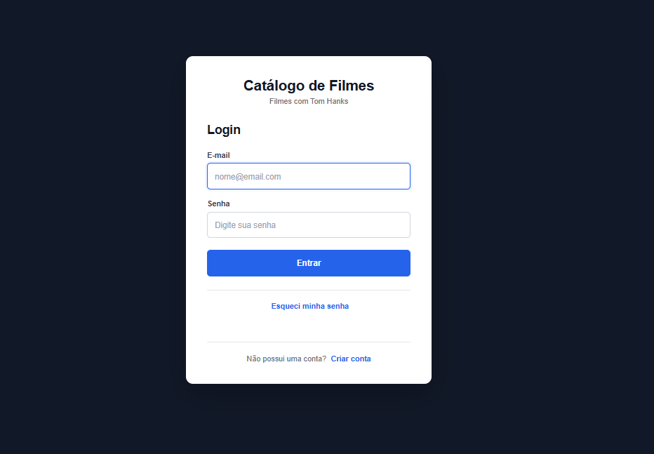
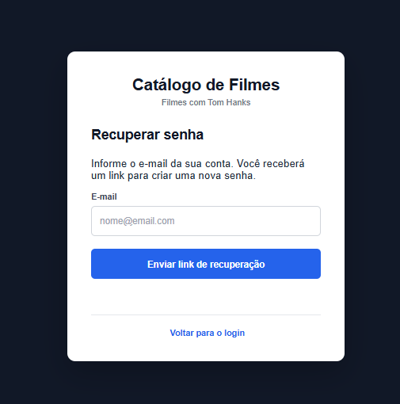
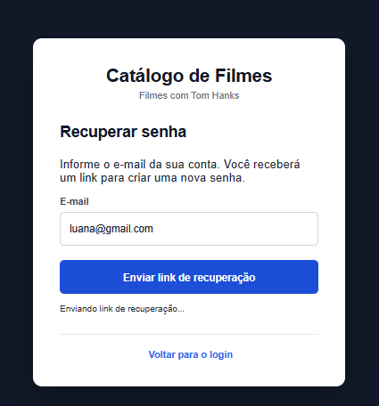
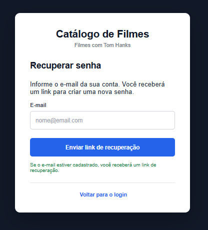
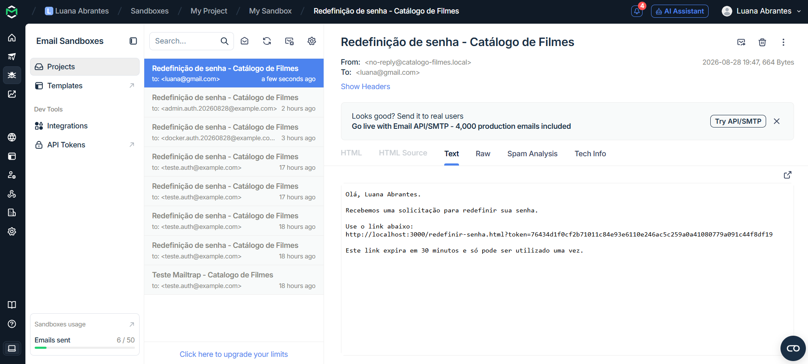
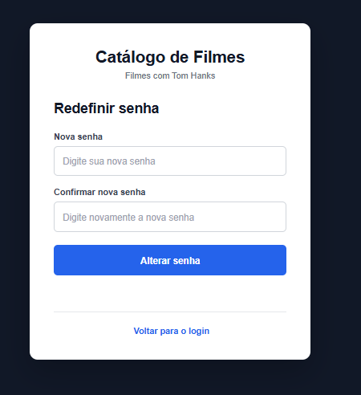
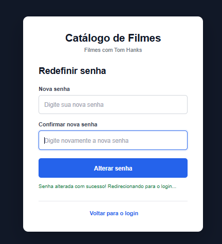
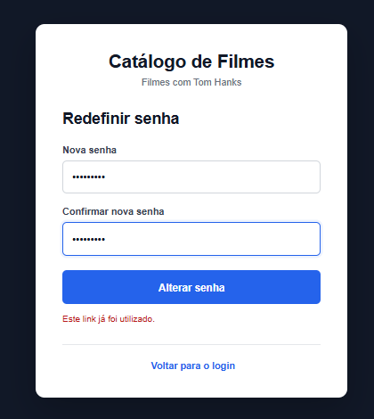

# Catálogo de Filmes — Tom Hanks

> Projeto desenvolvido para a disciplina **Introdução à Computação em Nuvem (ISW055)**, proposta pelo professor [@siriani](https://github.com/siriani).

Aplicação web em **Node.js + Express** que consulta filmes de Tom Hanks diretamente na API do **TMDB** e permite que usuários cadastrados mantenham seus próprios favoritos e comentários.

**Atividade 3 — Serviços desacoplados:** a autenticação foi separada do backend principal e transferida para um microsserviço chamado `auth-service`, responsável por cadastro, login, papéis de usuário e recuperação de senha. O catálogo continua sendo o único ponto de entrada público da aplicação.

---

## Stack

- **Catálogo:** Node.js + Express + MySQL2
- **Banco:** MariaDB
- **Autenticação:** `auth-service` + bcryptjs + JSON Web Token
- **Papéis:** `usuario` e `admin`
- **Recuperação de senha:** token aleatório, expiração de 30 minutos e uso único
- **E-mail:** Nodemailer + Mailtrap
- **Frontend:** HTML + CSS + JavaScript
- **Filmes:** TMDB API
- **Infraestrutura:** Docker + Docker Compose

---

## Arquitetura

A aplicação possui dois containers conectados pela mesma rede Docker e apenas um ponto de entrada público:

```text
Navegador
    │
    ▼
┌──────────────────────────┐
│        CATÁLOGO          │
│   Node.js + Express      │
│      porta 3000          │
│                          │
│ único ponto público      │
└────────────┬─────────────┘
             │
             │ catalogo-network
             │ rede interna Docker
             ▼
┌──────────────────────────┐
│      AUTH-SERVICE        │
│   Node.js + Express      │
│      porta 3001          │
│                          │
│ sem porta publicada      │
└───────┬──────────┬───────┘
        │          │
        ▼          ▼
     MariaDB    Mailtrap

Catálogo ─────────────────▶ TMDB API
```

- O `catalogo` é o único serviço com porta publicada para o host.
- O `auth-service` utiliza somente `expose: "3001"`.
- Os dois serviços compartilham a rede `catalogo-network`.
- O catálogo acessa o serviço de autenticação por `http://auth-service:3001`.
- O navegador nunca acessa diretamente o `auth-service`.
- O JWT é criado e validado pelo serviço de autenticação.
- Favoritos e comentários permanecem associados ao usuário autenticado.

### Docker Compose

```yaml
services:
  catalogo:
    build:
      context: .
      dockerfile: Dockerfile

    ports:
      - "3000:3000"

    env_file:
      - .env

    environment:
      AUTH_SERVICE_URL: http://auth-service:3001

    depends_on:
      - auth-service

    networks:
      - catalogo-network

  auth-service:
    build:
      context: ./auth-service
      dockerfile: Dockerfile

    env_file:
      - ./auth-service/.env

    expose:
      - "3001"

    dns:
      - 8.8.8.8
      - 1.1.1.1

    networks:
      - catalogo-network

networks:
  catalogo-network:
    driver: bridge
```

Somente o catálogo possui:

```yaml
ports:
  - "3000:3000"
```

O `auth-service` possui apenas:

```yaml
expose:
  - "3001"
```

Portanto, a porta `3001` fica disponível apenas dentro da rede Docker.

---

## Autenticação

Toda a lógica de autenticação está concentrada no diretório:

```text
auth-service/
```

O microsserviço é responsável por:

- cadastro;
- login;
- hash e validação de senha;
- geração e validação do JWT;
- papéis de usuário;
- recuperação de senha.

As senhas são transformadas em hash utilizando `bcryptjs` antes de serem armazenadas no MariaDB.

Novos usuários recebem automaticamente:

```text
role = usuario
```

O sistema também possui suporte ao papel:

```text
admin
```

Após um login válido, o `auth-service` gera um JWT contendo informações como:

```json
{
  "id": 1,
  "nome": "Usuário",
  "email": "usuario@email.com",
  "role": "usuario"
}
```

O catálogo recebe esse token e o armazena em um cookie `HttpOnly`.

Nas rotas protegidas, o catálogo encaminha o JWT internamente para:

```text
GET http://auth-service:3001/auth/validar
```

O serviço valida o token e retorna os dados do usuário autenticado.

---

## Recuperação de senha

O fluxo de recuperação de senha também pertence ao `auth-service`.

1. O usuário acessa **Esqueci minha senha**.
2. Informa o e-mail cadastrado.
3. O catálogo recebe a solicitação em:

```text
POST /api/auth/esqueci-senha
```

4. O catálogo encaminha a requisição ao `auth-service`.
5. O serviço gera um token com:

```javascript
crypto.randomBytes(32).toString('hex')
```

6. O token é armazenado na tabela `reset_tokens`.
7. Um e-mail com o link de redefinição é enviado pelo Mailtrap.
8. O usuário acessa o link pelo catálogo e informa uma nova senha.
9. Após a alteração, o token é marcado como utilizado.

A tabela `reset_tokens` possui:

```text
token
usuario_id
criado_em
expira_em
usado
```

Cada token possui validade de **30 minutos** e pode ser utilizado somente uma vez.

Antes de alterar a senha, o serviço verifica se o token:

- existe;
- não expirou;
- ainda não foi utilizado.

Exemplos de recusas:

```json
{
  "mensagem": "Token inválido."
}
```

```json
{
  "mensagem": "Este link já foi utilizado."
}
```

```json
{
  "mensagem": "Este link expirou. Solicite uma nova recuperação de senha."
}
```

A solicitação de recuperação utiliza uma mensagem genérica:

```text
Se o e-mail estiver cadastrado, você receberá um link de recuperação.
```

Assim, a aplicação não revela se determinado e-mail possui uma conta cadastrada.

---

## Como rodar localmente

### 1. Pré-requisitos

- Node.js 20+
- npm
- Docker
- Docker Compose
- banco MariaDB/MySQL
- token da API do TMDB
- conta no Mailtrap

### 2. Clonar o repositório

```bash
git clone https://github.com/Luanaabrantes/catalogo-filmes.git
cd catalogo-filmes
```

### 3. Configurar o catálogo

Crie `.env` na raiz utilizando `.env.example` como referência:

```env
DB_HOST=
DB_PORT=
DB_USER=
DB_PASSWORD=
DB_NAME=

TMDB_TOKEN=

AUTH_SERVICE_URL=http://localhost:3001

PORT=3000
NODE_ENV=development
```

### 4. Configurar o auth-service

Crie `auth-service/.env` utilizando `auth-service/.env.example`:

```env
PORT=3001

DB_HOST=
DB_PORT=
DB_USER=
DB_PASSWORD=
DB_NAME=

JWT_SECRET=

MAIL_HOST=sandbox.smtp.mailtrap.io
MAIL_PORT=587
MAIL_USER=
MAIL_PASS=
MAIL_FROM=no-reply@catalogo-filmes.local

CATALOGO_URL=http://localhost:3000
```

Os arquivos `.env` possuem dados sensíveis e não são enviados ao GitHub.

### 5. Atualizar o banco

Para um banco utilizado anteriormente na Atividade 2, execute:

```text
database/migracao-atividade3.sql
```

A migração:

- adiciona o campo `role` à tabela `usuarios`;
- cria a tabela `reset_tokens`.

### 6. Subir os containers

```bash
docker compose up -d --build
```

Verifique:

```bash
docker compose ps
```

O resultado deve ser semelhante a:

```text
SERVICE        PORTS

auth-service   3001/tcp
catalogo       0.0.0.0:3000->3000/tcp
```

Somente o catálogo possui uma porta publicada para o host.

A aplicação pode ser acessada em:

```text
http://localhost:3000
```

### 7. Testar o isolamento do auth-service

Uma tentativa direta:

```bash
curl http://localhost:3001/health
```

deve falhar.

Dentro da rede Docker:

```bash
docker compose exec catalogo node -e "fetch('http://auth-service:3001/health').then(r=>r.text()).then(console.log)"
```

deve retornar o status do serviço.

Isso confirma que:

```text
Host ──X──▶ Auth Service
```

mas:

```text
Catálogo ─────▶ Auth Service
```

funciona pela rede interna.

---

## Endpoints

### Catálogo — público

| Método | Rota | Auth | Descrição |
|---|---|---|---|
| POST | `/api/auth/cadastro` | Não | Cadastra usuário |
| POST | `/api/auth/login` | Não | Realiza login |
| GET | `/api/auth/me` | Sim | Retorna usuário autenticado |
| POST | `/api/auth/logout` | Não | Encerra sessão |
| POST | `/api/auth/esqueci-senha` | Não | Solicita recuperação |
| POST | `/api/auth/redefinir-senha` | Não | Redefine a senha |
| GET | `/api/filmes` | Sim | Lista filmes de Tom Hanks |
| GET | `/api/favoritos` | Sim | Lista favoritos |
| POST | `/api/favoritos/:movieId` | Sim | Adiciona favorito |
| DELETE | `/api/favoritos/:movieId` | Sim | Remove favorito |
| GET | `/api/comentarios` | Sim | Lista comentários |
| GET | `/api/comentarios/:movieId` | Sim | Comentários de um filme |
| POST | `/api/comentarios/:movieId` | Sim | Adiciona comentário |
| DELETE | `/api/comentarios/:id` | Sim | Remove comentário |

### Auth Service — interno

| Método | Rota | Descrição |
|---|---|---|
| POST | `/auth/cadastro` | Cadastra usuário |
| POST | `/auth/login` | Valida credenciais e gera JWT |
| GET | `/auth/validar` | Valida o JWT |
| POST | `/auth/esqueci-senha` | Gera token e envia o e-mail |
| POST | `/auth/redefinir-senha` | Valida token e altera senha |
| GET | `/health` | Verifica o serviço |

---

## Estrutura do projeto

```text
catalogo-filmes/
│
├── auth-service/
│   ├── src/
│   │   ├── auth.js
│   │   ├── database.js
│   │   ├── mailer.js
│   │   ├── recuperacaoSenha.js
│   │   └── server.js
│   ├── .env.example
│   ├── Dockerfile
│   └── package.json
│
├── database/
│   └── migracao-atividade3.sql
│
├── docs/
│   └── evidencias/
│
├── public/
│   ├── index.html
│   ├── cadastro.html
│   ├── catalogo.html
│   ├── esqueci-senha.html
│   ├── redefinir-senha.html
│   └── ...
│
├── src/
│   ├── auth.js
│   ├── comentarios.js
│   ├── database.js
│   ├── favoritos.js
│   ├── filmes.js
│   ├── middlewareAuth.js
│   └── server.js
│
├── .env.example
├── docker-compose.yml
├── Dockerfile
├── package.json
└── README.md
```

---

## Notas de segurança / design

- os filmes são consultados diretamente no TMDB e não são armazenados no banco;
- as senhas são armazenadas utilizando hash com `bcryptjs`;
- o JWT é gerado e validado pelo `auth-service`;
- o JWT possui expiração;
- o token da sessão é armazenado em cookie `HttpOnly`;
- o `auth-service` não possui porta publicada;
- os serviços se comunicam pela rede interna Docker;
- arquivos `.env` não são versionados;
- novos usuários recebem `role = usuario`;
- o `usuario_id` é obtido pela autenticação;
- favoritos e comentários são filtrados pelo usuário autenticado;
- a recuperação não revela se o e-mail informado está cadastrado;
- tokens de recuperação são criptograficamente aleatórios;
- tokens expiram após 30 minutos;
- cada token pode ser utilizado somente uma vez.

---

## Evidências

Evidências da **Atividade 3 — Serviços desacoplados**, demonstrando o fluxo completo de recuperação e redefinição de senha.

### 1. Tela de login

A tela de login apresenta a opção **Esqueci minha senha**, utilizada para iniciar o processo de recuperação.



---

### 2. Tela de recuperação de senha

Ao selecionar **Esqueci minha senha**, o usuário é direcionado para a tela onde informa o e-mail da conta.



---

### 3. Envio da solicitação de recuperação

Após informar o e-mail, a aplicação envia a solicitação de recuperação.



---

### 4. Solicitação de recuperação confirmada

Após o processamento, a aplicação informa que, caso o e-mail esteja cadastrado, será enviado um link de recuperação.



---

### 5. E-mail recebido no Mailtrap

O `auth-service` gera o token de recuperação e envia o link de redefinição por e-mail utilizando o Mailtrap.

O link possui validade de **30 minutos** e pode ser utilizado apenas uma vez.



---

### 6. Tela de redefinição de senha

O link recebido por e-mail direciona o usuário para a tela de redefinição de senha do catálogo.



---

### 7. Senha redefinida com sucesso

Após a validação do token, a nova senha é cadastrada com sucesso e o token é marcado como utilizado.



---

### 8. Reutilização do link recusada

Após a utilização do token, uma nova tentativa de redefinir a senha utilizando o mesmo link é recusada.



## Repositório

https://github.com/Luanaabrantes/catalogo-filmes

---

Desenvolvido por **Luana Abrantes** para a disciplina **ISW055 — Introdução à Computação em Nuvem**.
