# Catálogo de Filmes — Tom Hanks

Aplicação acadêmica desenvolvida para a disciplina **Introdução à Computação em Nuvem (ISW055)**, no semestre 2026.2, com catálogo de filmes, autenticação, controle de acesso por papel e auditoria centralizada.

**Professor:** [@siriani](https://github.com/siriani)

**Aplicação publicada:** [https://luana-abrantes-isw055.lapps.studio/](https://luana-abrantes-isw055.lapps.studio/)

## Funcionalidades

- Consulta filmes relacionados a Tom Hanks pela API do TMDB. Os dados dos filmes não são persistidos no MariaDB.
- Cadastro, login, logout e recuperação de senha por e-mail.
- Favoritos e comentários persistidos e associados ao usuário autenticado.
- Autorização RBAC para ações administrativas, incluindo moderação de comentários, auditoria e gerenciamento de papéis.
- Painel administrativo com Visão geral, Auditoria e Usuários.
- Registro de eventos em um Redis Stream pelo serviço dedicado `log-service`.
- Perfil com foto no MinIO, bio e favoritos, com edição exclusiva pelo proprietário.

## Arquitetura atual

```text
Navegador
    │ HTTP/HTTPS
    ▼
Catálogo / Express :3000 ───────► auth-service :3001 ───────► MariaDB
    │                                  │                         (externo ao Compose)
    ├──► MinIO :9000 (fotos; volume minio-data)
    │                                  └──── POST /eventos ──┐
    └──────────────────── POST /eventos ────────────────────┤
                                                            ▼
                                                     log-service :3002
                                                            │
                                                            ▼
                                                   Redis Stream :6379
```

O navegador acessa somente o catálogo. `auth-service`, `log-service`, Redis e MinIO não publicam portas no host: a comunicação entre os microsserviços ocorre na rede Docker `catalogo-network`. O `log-service` é o único componente que acessa Redis; catálogo e `auth-service` enviam eventos para ele por HTTP.

O MariaDB continua fornecendo os dados de negócio e autenticação, mas é uma dependência externa: não há serviço MariaDB definido nos Compose deste projeto.

| Serviço | Responsabilidade | Acesso/porta |
|---|---|---|
| `catalogo` | Frontend, API pública, TMDB, favoritos, comentários, sessão e proxy administrativo | Único publicado: local `3000:3000`; Portainer `8216:3000` |
| `auth-service` | Cadastro, autenticação, validação da sessão, papel atual, recuperação de senha e gestão administrativa de usuários | Interno, `3001` |
| `log-service` | Validação, gravação e consulta de eventos de auditoria | Interno, `3002` |
| `redis` | Persistência do Stream `auditoria` | Interno, `6379` |
| `minio` | Fotos de perfil | Interno, `9000`; leitura intermediada pelo catálogo |

Não é necessário expor `3001`, `3002` ou `6379` ao host.

### Evolução das atividades

- **Atividade 3:** autenticação desacoplada no `auth-service`, papéis e recuperação de senha. A descrição daquela etapa com catálogo e `auth-service` corresponde à arquitetura histórica, não à composição atual.
- **Atividade 4:** autorização RBAC aplicada às operações protegidas e moderação de comentários.
- **Atividade 5:** serviço de auditoria próprio, Redis Streams, consulta administrativa e painel de gestão.

## Serviços e Docker Compose

O Compose local é `docker-compose.yml`; para produção no Portainer, use `docker-compose.portainer.yml`. Ambos definem `catalogo`, `auth-service`, `log-service`, `redis` e `minio` na mesma rede `catalogo-network`.

No ambiente local, apenas o catálogo publica `3000:3000`. No Compose do Portainer, ele publica `8216:3000`, usa `NODE_ENV=production` e recebe configuração por variáveis do ambiente do Portainer: `DB_HOST`, `DB_PORT`, `DB_USER`, `DB_PASSWORD`, `DB_NAME`, `TMDB_TOKEN`, `JWT_SECRET` e `MAIL_HOST`, `MAIL_PORT`, `MAIL_USER`, `MAIL_PASS`, `MAIL_FROM`. `CATALOGO_URL` aponta para a aplicação publicada. Esse arquivo também preserva a configuração DNS do `auth-service` e a rede IPAM existente (`10.88.0.0/24`). Valores secretos não são gravados no Compose nem devem ser colocados no Git.

Variáveis internas relevantes:

```text
AUTH_SERVICE_URL=http://auth-service:3001
LOG_SERVICE_URL=http://log-service:3002
REDIS_URL=redis://redis:6379
```

Redis usa a imagem `redis:7.4-alpine`, inicia com AOF (`--appendonly yes`) e persiste dados no volume `audit-redis-data`; o volume precisa ser preservado para manter os dados entre recriações do container. O healthcheck executa `redis-cli ping`; o `log-service` aguarda Redis saudável e também possui healthcheck em `/health`. No Compose do Portainer, os cinco serviços usam `restart: unless-stopped`.

O Compose não define container para MariaDB: `DB_HOST`, `DB_PORT`, `DB_USER`, `DB_PASSWORD` e `DB_NAME` devem apontar para a instância externa configurada no ambiente. Da mesma forma, TMDB, JWT e SMTP são configurados por variáveis de ambiente.

## Autenticação, sessão e segurança

O `auth-service` gera e valida JWT. No login, o catálogo armazena o token em cookie `HttpOnly`, com `SameSite=Lax`; `Secure` é ativado quando `NODE_ENV=production`. O JWT e o cookie têm duração de **8 horas**, conforme a implementação atual. O logout registra o evento quando possível e limpa o cookie.

O frontend não lê nem armazena o token em `localStorage` ou `sessionStorage`. Abas da mesma origem compartilham o cookie de sessão; ao voltar a ficar visível, o painel administrativo consulta `/api/auth/me` para atualizar a identidade e redirecionar conforme o papel atual.

Em cada validação, o `auth-service` verifica assinatura e validade do JWT e consulta o usuário no MariaDB pelo ID do token. O `id`, nome, e-mail e `role` retornados vêm do estado atual do banco; o papel antigo incluído na emissão do JWT não é a fonte de autorização. Uma alteração de papel pode, portanto, refletir na sessão existente na próxima validação.

Senhas são armazenadas como hash com `bcryptjs`. Segredos e credenciais são fornecidos por variáveis de ambiente; arquivos `.env` reais não devem ser versionados. Os produtores da auditoria não enviam senha, hash, JWT, cookie ou token de recuperação. O `log-service` também recusa campos sensíveis em `detalhes`, inclusive em estruturas aninhadas; isso é uma validação por nomes de campos, não um detector geral de segredos em texto livre.

### Recuperação de senha

O fluxo é intermediado pelo catálogo e processado pelo `auth-service`. O token de recuperação é aleatório, armazenado em `reset_tokens`, expira em 30 minutos e só pode ser usado uma vez. A resposta da solicitação não revela se o e-mail existe. O envio usa as variáveis SMTP `MAIL_HOST`, `MAIL_PORT`, `MAIL_USER`, `MAIL_PASS` e `MAIL_FROM`; o exemplo de desenvolvimento configura Mailtrap Email Testing.

## RBAC e operações administrativas

Os únicos papéis são `usuario` e `admin`. O cadastro público sempre define `usuario`; o cliente não escolhe `admin`. Autenticação identifica a sessão, enquanto autorização verifica o papel atual no backend. A interface não é a fronteira de segurança.

Um usuário comum pode consultar o catálogo, gerir os próprios favoritos, criar comentários e excluir os próprios comentários. Um administrador pode também excluir comentários alheios para moderação, consultar auditoria e gerenciar os papéis dos usuários.

O gerenciamento de usuários é implementado no `auth-service` e protegido por autenticação e verificação administrativa. A alteração de papel:

- aceita somente `usuario` ou `admin`;
- não permite alterar o próprio papel;
- impede rebaixar o último administrador;
- responde sem alteração quando o usuário já possui o papel solicitado;
- registra `ROLE_ALTERADA` somente quando o papel realmente muda.

As tentativas autenticadas sem papel suficiente retornam `403` e geram `ACAO_NEGADA`. Falta de autenticação ou sessão inválida retorna `401` e não é registrada como ação negada. A aplicação atualiza a autorização com base no papel consultado no banco, não somente no conteúdo original do JWT.

### Endpoints administrativos

| Método e endpoint público | Acesso | Descrição |
|---|---|---|
| `GET /api/admin/usuarios` | Admin | Lista usuários com nome, e-mail e papel |
| `PATCH /api/admin/usuarios/:id/role` | Admin | Altera o papel do usuário indicado |
| `GET /api/logs` ou `GET /api/logs?limit=N` | Admin | Consulta eventos de auditoria via catálogo |

O catálogo valida a sessão e o papel antes de encaminhar operações administrativas. O `auth-service` também valida Bearer Token e papel atual nas rotas internas `/auth/admin/usuarios` e `/auth/admin/usuarios/:id/role`.

## Atividade 5 — Logs e auditoria

A auditoria registra quem executou uma ação, qual ação ocorreu, quando ocorreu e o contexto associado; o IP é incluído quando disponível. O log-service centraliza a persistência, em vez de gravar logs de auditoria em arquivos locais dos serviços.

### Evento e Redis Stream

Cada registro pode conter:

| Campo | Significado |
|---|---|
| `usuario_id` | ID do usuário responsável, como string no Stream |
| `acao` | Nome da ação registrada |
| `timestamp` | Data e hora ISO 8601 normalizada para UTC pelo `log-service` |
| `ip` | Endereço de origem, quando disponível |
| `detalhes` | Contexto opcional em objeto JSON |

O timestamp recebido precisa ser ISO 8601 válido com fuso; se não for enviado, o `log-service` define a data/hora atual. O Redis Stream se chama `auditoria`. O serviço grava com `XADD` e consulta os N registros mais recentes com `XREVRANGE`; em seguida, devolve a seleção em ordem cronológica crescente. O AOF e o volume `audit-redis-data` mantêm os dados do Redis entre reinicializações do container.

### Eventos implementados

| Evento | Quando é registrado |
|---|---|
| `LOGIN` | Após credenciais confirmadas e JWT gerado |
| `LOGOUT` | Quando a sessão validada é encerrada |
| `FILME_FAVORITADO` | Após inserir o favorito |
| `FILME_DESFAVORITADO` | Quando a remoção realmente exclui o favorito |
| `COMENTARIO_CRIADO` | Após inserir o comentário |
| `COMENTARIO_APAGADO` | Após exclusão autorizada de comentário |
| `ACAO_NEGADA` | Para operação proibida de usuário autenticado |
| `ROLE_ALTERADA` | Quando o papel de outro usuário é realmente alterado |

Na exclusão de comentário, o proprietário pode remover o próprio conteúdo. Admin pode remover comentário alheio; nesse caso, o evento contém `moderacao: true`. A remoção do próprio comentário, mesmo pelo admin, não é marcada como moderação. A auditoria registra IDs e contexto, não o texto completo do comentário.

Os casos de negação incluem exclusão proibida de comentário, consulta administrativa de logs e gestão administrativa de usuários. O catálogo interrompe uma consulta de logs negada antes de chamar o serviço interno, evitando duplicar `ACAO_NEGADA`. Uma chamada direta autenticada ao GET interno do `log-service` por usuário comum gera o evento específico `CONSULTA_LOGS_INTERNA`. Erros `401` não geram ação negada.

O registro é de melhor esforço: se o `log-service` falha depois que a operação de negócio foi concluída, a falha de auditoria não desfaz a operação. A chamada pode aguardar até dois segundos antes de falhar e emitir aviso no log do serviço chamador; não há fila de reenvio. Em contraste, a consulta administrativa retorna `503` quando o serviço de auditoria necessário está indisponível.

### Consulta administrativa

O navegador consulta o catálogo com cookie HttpOnly. O catálogo valida a sessão e o papel atual e encaminha um Bearer Token ao `log-service`, que consulta novamente o `auth-service` antes de ler o Redis:

```text
Admin ── GET /api/logs?limit=N + cookie ──► Catálogo
                                              │ valida sessão e papel atual
                                              │ Authorization: Bearer <token>
                                              ▼
                                         log-service
                                              │ valida no auth-service
                                              ▼
                                      Redis Stream auditoria
```

| Método e endpoint | Serviço | Regra |
|---|---|---|
| `GET /api/logs` | Catálogo | Rota do catálogo; exige sessão e papel `admin` |
| `GET /api/logs?limit=N` | Catálogo | Repassa o limite para o serviço interno |
| `GET /eventos` ou `GET /eventos?limit=N` | log-service | Interno; exige Bearer Token válido e papel atual `admin` |
| `POST /eventos` | log-service | Interno; recebe e valida evento para gravação |
| `GET /health` | log-service | Indica estado do serviço e conexão Redis |

O limite de leitura padrão é **50**, com faixa de **1 a 100** (inteiros). O retorno inclui `quantidade` e `eventos`. Limite inválido retorna `400`; ausência de sessão ou token inválido retorna `401`; usuário autenticado sem papel admin retorna `403`; indisponibilidade do serviço ou Redis retorna `503`. A rota interna de gravação não exige token na implementação atual e não é publicada no host.

### Painel administrativo

O painel em `/admin.html` fica disponível somente a usuários cujo papel atual seja `admin`. A interface tem três áreas:

#### Visão geral

Apresenta eventos analisados, logins, ações negadas e alterações de acesso referentes à quantidade de eventos carregada naquele momento, além de usuários cadastrados, número de administradores, atividade recente e eventos de segurança/acesso. As métricas não representam necessariamente o histórico total. A lista recente mostra até cinco eventos; a lista de segurança, até três eventos `ACAO_NEGADA` ou `ROLE_ALTERADA`. Totais de usuários usam `GET /api/admin/usuarios` e podem aparecer como indisponíveis se essa consulta falhar.

#### Auditoria

Permite consultar e pesquisar eventos por ação, usuário ou recurso, filtrar pela ação, selecionar 20, 50 ou 100 registros e atualizar a consulta. Exibe data/hora, usuário, ação, contexto, IP e detalhes no drawer. Quando a lista de usuários está disponível, a interface pode apresentar nome e ID; a consulta de auditoria não depende dessa lista. A interface é apenas apresentação: catálogo, log-service e auth-service mantêm as verificações de sessão e autorização no backend.

#### Usuários

Lista nome, e-mail e papel, oferece pesquisa e identifica a própria conta. Admin pode alternar papéis entre `usuario` e `admin`, sujeito às proteções do backend descritas acima. Não há outros papéis nem permissões granulares nesta implementação.

## API do catálogo

Rotas públicas do catálogo incluem:

| Método e endpoint | Acesso/uso |
|---|---|
| `POST /api/auth/cadastro` | Cadastro; novo papel sempre `usuario` |
| `POST /api/auth/login` | Autenticação e emissão do cookie de sessão |
| `GET /api/auth/me` | Identidade e papel atuais da sessão |
| `POST /api/auth/logout` | Encerra sessão |
| `POST /api/auth/esqueci-senha` | Inicia recuperação de senha |
| `POST /api/auth/redefinir-senha` | Redefine a senha com token válido |
| `GET /api/filmes` | Catálogo de filmes, com sessão |
| `GET /api/favoritos`, `POST /api/favoritos/:movieId`, `DELETE /api/favoritos/:movieId` | Consulta e gestão de favoritos da sessão |
| `GET /api/comentarios`, `GET /api/comentarios/:movieId`, `POST /api/comentarios/:movieId`, `DELETE /api/comentarios/:id` | Consulta, criação e exclusão autorizada de comentários |

Rotas administrativas adicionais estão listadas acima. O frontend não chama diretamente os microsserviços internos.

## Banco de dados e TMDB

O MariaDB guarda usuários, favoritos, comentários e tokens de recuperação. A migração `database/migracao-atividade3.sql` adiciona `role` com padrão `usuario` e a tabela `reset_tokens`. Favoritos e comentários são associados a `usuario_id` obtido da sessão autenticada, não de um ID de proprietário livremente escolhido no frontend.

O catálogo consulta a API do TMDB em tempo de execução para localizar filmes relacionados a Tom Hanks e seus dados, incluindo pôster. Esses dados não são armazenados no MariaDB.

## Estrutura representativa

```text
catalogo-filmes/
├── public/
│   ├── admin.html
│   ├── admin.js
│   ├── catalogo.html
│   ├── catalogo.js
│   └── style.css
├── src/
│   ├── admin.js
│   ├── auditoria.js
│   ├── auth.js
│   ├── comentarios.js
│   ├── favoritos.js
│   ├── logs.js
│   ├── middlewareAuth.js
│   └── server.js
├── auth-service/
│   └── src/
│       ├── admin.js
│       ├── auditoria.js
│       ├── auth.js
│       ├── gestaoUsuarios.js
│       ├── middlewareAuth.js
│       ├── recuperacaoSenha.js
│       └── server.js
├── log-service/
│   ├── src/
│   │   ├── consulta.js
│   │   ├── evento.js
│   │   ├── eventos.js
│   │   ├── middlewareAuth.js
│   │   ├── redis.js
│   │   └── server.js
│   ├── test/
│   ├── Dockerfile
│   └── package.json
├── database/
│   └── migracao-atividade3.sql
├── docker-compose.yml
├── docker-compose.portainer.yml
└── README.md
```

## Configuração e execução local

Pré-requisitos: Docker com Docker Compose, acesso a um MariaDB externo, credencial do TMDB e configuração SMTP para recuperação de senha.

Use `.env.example`, `auth-service/.env.example` e `log-service/.env.example` como referência. Preencha localmente `.env` e `auth-service/.env` com seus próprios valores; não versione arquivos reais nem compartilhe segredos. O Compose injeta as URLs internas de serviço e configura Redis sem instalação manual na máquina.

Na raiz do projeto:

```bash
docker compose up -d --build
docker compose ps
```

A aplicação local fica em [http://localhost:3000](http://localhost:3000). Apenas o serviço `catalogo` deve mostrar porta publicada no host; os outros serviços ficam disponíveis pela rede interna.

Para executar no Portainer, mantenha `docker-compose.portainer.yml` como caminho do Compose da stack e configure as variáveis de ambiente exigidas, incluindo `IMAGE_TAG=sha-<hash completo do commit aprovado no CI/CD>`. Esse arquivo utiliza as imagens publicadas no GHCR, sem build local; configure o acesso ao registro conforme a seção CI/CD. O catálogo será publicado na porta `8216` do host. Não configure mapeamentos de host para as portas 3001, 3002 ou 6379.

Verificações internas opcionais:

```bash
docker compose exec log-service node -e "fetch('http://127.0.0.1:3002/health').then(async r => console.log(r.status, await r.text()))"
docker compose exec redis redis-cli PING
docker compose exec redis redis-cli XRANGE auditoria - +
docker compose exec redis redis-cli XREVRANGE auditoria + - COUNT 20
```

`XRANGE` percorre o Stream do ID mais antigo ao mais recente. `XREVRANGE` mostra os registros mais novos primeiro; a API inverte o conjunto selecionado para retornar sequência cronológica dentro do limite escolhido.

## Testes disponíveis

Os testes automatizados do projeto estão em `test/admin.test.js`, `auth-service/test/admin.test.js` e `log-service/test/consulta.js`. Execute-os com Node.js:

```bash
node --test test/admin.test.js
node --test auth-service/test/admin.test.js
node --test log-service/test/consulta.js
```

Eles cobrem, respectivamente, proxy e rotas administrativas do catálogo, gestão de papéis e leitura/autenticação do Stream. `log-service/test/eventos.js` é um roteiro de integração que exige os containers ativos; no PowerShell, pode ser executado assim:

```powershell
Get-Content log-service/test/eventos.js -Raw | docker compose exec -T log-service node
```

Os incrementos da Atividade 5 também foram validados com Docker Compose e testes de integração para healthcheck, isolamento das portas, respostas 400/401/403/503, persistência Redis, auditoria de operações e comportamento quando o serviço de logs fica indisponível. Resultados anteriores documentam cenários de teste, não garantem disponibilidade contínua do ambiente externo.

## Demonstração da Atividade 5

### Usuário comum

1. Fazer login com conta de papel `usuario`.
2. Favoritar um filme e criar um comentário.
3. Tentar consultar uma operação administrativa sem permissão, como `GET /api/logs`.
4. Confirmar `403 Forbidden` e o evento `ACAO_NEGADA` correspondente na auditoria.

### Administrador

1. Fazer login com uma conta cujo papel atual seja `admin`.
2. Abrir o painel, acessar **Auditoria** e consultar os eventos recentes.
3. Inspecionar a sequência, o contexto e os detalhes no painel.

Uma sequência conceitual possível é `LOGIN`, `FILME_FAVORITADO`, `COMENTARIO_CRIADO` e `ACAO_NEGADA`. IDs e timestamps dependem da execução; não há IDs fixos necessários para a demonstração.

### Evidência — consulta como administrador

A evidência visual da consulta dos logs pelo painel administrativo será adicionada antes da entrega final.

<!--

-->


## Atividade 6 — Upload e perfil de usuário

A página `/perfil.html`, acessível por **Meu perfil**, apresenta nome, foto, bio e favoritos. Para consultar outro perfil autenticado, use `/perfil.html?id=ID`. A edição aparece somente no próprio perfil; o backend também verifica essa regra.

> A imagem não é armazenada no MariaDB. O arquivo binário é persistido no MinIO e o MariaDB mantém apenas a chave/referência do objeto.

### Estrutura e execução

A migração `database/migracao-atividade6.sql` cria somente `perfis`, com `usuario_id` (chave primária e estrangeira para `usuarios.id`, com exclusão em cascata), `bio VARCHAR(300)` e `foto_chave VARCHAR(500)`. Usa `CREATE TABLE IF NOT EXISTS`, preserva os dados e não recria tabelas anteriores. Favoritos reutilizam a tabela existente e seus IDs do TMDB; os dados visuais dos filmes não são duplicados no MariaDB.

O Compose não aplica essa migração automaticamente. Aplique-a ao banco configurado antes de consultar o perfil. Com o catálogo ativo, no PowerShell:

```powershell
Get-Content database/migracao-atividade6.sql -Raw | docker compose exec -T catalogo node -e "const db=require('./src/database');let sql='';process.stdin.on('data',c=>sql+=c);process.stdin.on('end',async()=>{try{await db.query(sql);console.log('Migração aplicada.')}catch(e){console.error(e.code);process.exitCode=1}finally{await db.end()}})"
```

Confirme com `SHOW TABLES LIKE 'perfis';` e `DESCRIBE perfis;`. No Portainer, aplique a migração ao banco correspondente e configure as variáveis abaixo.

| Variável | Uso |
|---|---|
| `MINIO_ENDPOINT` | Host; no Compose, `minio` |
| `MINIO_PORT` | Porta interna; no Compose, `9000` |
| `MINIO_USE_SSL` | TLS entre backend e armazenamento; `false` na rede interna configurada |
| `MINIO_ACCESS_KEY` | Credencial fornecida no ambiente, nunca no frontend |
| `MINIO_SECRET_KEY` | Segredo fornecido no ambiente, nunca no Git |
| `MINIO_BUCKET` | Bucket dedicado; padrão `perfil-fotos` |

Use `.env.example` como referência. Os Compose fixam o endereço interno do MinIO. O volume `minio-data`, montado em `/data`, mantém os arquivos entre reinicializações/recriações. Preserve esse volume e `audit-redis-data`; não use `down -v` para uma simples atualização.

`minio/Dockerfile` compila o código oficial do MinIO na versão fixada no arquivo. A primeira construção pode demorar. O healthcheck consulta `/minio/health/live`; o console não é publicado. Suba com `docker compose up -d --build` e confira os cinco serviços com `docker compose ps`.

### Upload, propriedade e auditoria

O bucket é único para todas as fotos. As chaves seguem `perfis/{usuarioId}/{uuid}.jpg` (ou `.png`/`.webp`), sem usar o nome original enviado. O backend verifica/cria o bucket no primeiro upload.

1. Validar sessão e propriedade a partir de `req.usuario.id`.
2. Receber um arquivo no campo `foto`, por `multipart/form-data`: JPEG, PNG ou WebP, até **5 MB** (5 × 1024 × 1024 bytes).
3. Verificar MIME e decodificar com Sharp, sem confiar somente na extensão; reencodar e remover metadados.
4. Enviar o objeto ao MinIO e persistir sua chave no MariaDB em transação.
5. Somente após o commit, remover a foto anterior. Falha na limpeza não invalida a foto nova.

Falha no banco antes do commit provoca rollback e tentativa de limpeza do objeto novo. Se o resultado do commit for incerto, ambas as imagens são preservadas para evitar apagar uma referência válida. **Alterar foto** abre o seletor oculto e inicia o upload após a seleção, com validações e mensagens de andamento/resultado.

| Método e endpoint | Regra |
|---|---|
| `GET /api/perfil/me` | Perfil da sessão e favoritos |
| `GET /api/perfil/:id` | Consulta por usuário autenticado |
| `PATCH /api/perfil/:id` | Altera somente a própria bio; JSON com `bio`, até 300 caracteres |
| `POST /api/perfil/:id/foto` | Altera somente a própria foto; multipart com campo `foto` |
| `GET /api/perfil/fotos/:usuarioId/:arquivo` | Leitura pública da imagem, intermediada pelo catálogo |

A consulta retorna ID, nome, bio, `foto_chave`, `foto_url`, favoritos e indicação de propriedade. O backend compara `Number(req.params.id)` com `Number(req.usuario.id)` e ignora identidade enviada no corpo. Mesmo um administrador não pode editar perfil alheio. Sem sessão: `401`; tentativa alheia: `403`; arquivo/bio inválido: `400`; tamanho excedido: `413`; falha de infraestrutura: `503`.

A auditoria existente registra `PERFIL_ATUALIZADO`, `FOTO_PERFIL_ATUALIZADA` e `ACAO_NEGADA` para tentativa alheia, com recurso `PERFIL`, operação e ID alvo quando pertinente. Não envia imagem, bio, senha, JWT, cookie ou credenciais. Mantém o melhor esforço do `log-service`.

### Leitura pública e alternativa pré-assinada

O bucket permite somente `s3:GetObject` público no prefixo `perfis/`. A escrita permanece restrita ao backend. A URL estável usa `/api/perfil/fotos/...`; o catálogo lê o objeto anonimamente na rede interna, sem entregar credenciais ao navegador.

| Estratégia | Vantagens | Limitações |
|---|---|---|
| Bucket com leitura pública (adotado) | Simples, URL estável e fácil uso no frontend; adequado a fotos públicas | Qualquer pessoa que conheça a URL pode acessar a imagem |
| URL pré-assinada | Maior controle e expiração; adequada a arquivos privados | Mais complexidade e URLs precisam ser regeneradas; desnecessária para fotos públicas neste projeto |

### Arquivos e testes da Atividade 6

- Interface: `public/perfil.html`, `public/perfil.js` e estilos em `public/style.css`.
- Backend: `src/perfil.js`, `src/fotoPerfil.js`, `src/minio.js` e consulta compartilhada em `src/listarFavoritos.js`.
- Infraestrutura: `database/migracao-atividade6.sql`, `minio/Dockerfile`, ambos os Compose e `.env.example`.
- Testes: `test/perfil.test.js`, `test/minio.test.js` e roteiro integrado `test/perfil-integracao.js`.

Com as dependências instaladas na raiz, em `auth-service` e em `log-service`, execute `npm test`. Nesta entrega: **49 testes aprovados, 0 falhas**, incluindo os testes anteriores. Cobrem autenticação, propriedade, favoritos do usuário correto, upload válido/inválido, limite de tamanho, falhas de MinIO/banco e auditoria, usando mocks quando apropriado. O roteiro integrado exige ambiente descartável com banco `catalogo_qa` e serviços de teste; não deve ser executado no banco de produção.

## Demonstração da Atividade 6

### Perfil

1. Fazer login e acessar **Meu perfil**.
2. Usar **Editar perfil** para salvar uma bio e **Alterar foto** para enviar uma imagem válida.
3. Favoritar filmes no catálogo e retornar ao perfil.
4. Confirmar foto realmente carregada, bio e pôsteres dos favoritos; capturar a página.
5. Para conferir persistência, executar `docker compose restart minio` e recarregar a página quando o serviço estiver saudável.

### Tentativa de editar outro usuário

1. Autenticar como usuário A e identificar o ID real de B (na conta B ou no painel de usuários como administrador).
2. No console do navegador da sessão A, executar e informar o ID de B:

```javascript
const idAlvo = Number(prompt('ID do outro usuário'));
const resposta = await fetch('/api/perfil/' + idAlvo, {
  method: 'PATCH',
  headers: { 'Content-Type': 'application/json' },
  body: JSON.stringify({ bio: 'Tentativa de edição de outro perfil' })
});
console.log(resposta.status, await resposta.json());
```

3. Confirmar `403 Forbidden` e `Você só pode editar o próprio perfil.`; capturar o console ou a requisição na aba Network.
4. Opcionalmente, autenticar como administrador, abrir **Auditoria**, atualizar e filtrar `ACAO_NEGADA`. Conferir recurso `PERFIL`, alvo e operação `ATUALIZAR_BIO`.

### Evidência — perfil com foto, bio e favoritos

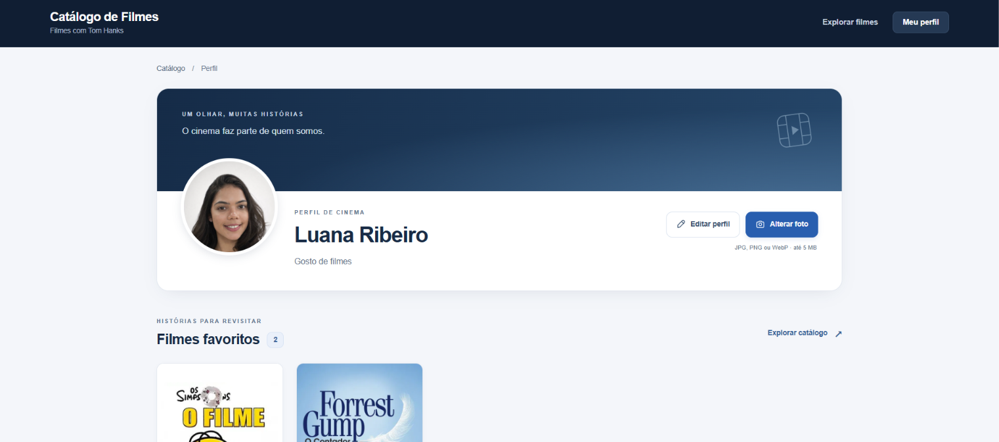

### Evidência — tentativa recusada de editar outro perfil

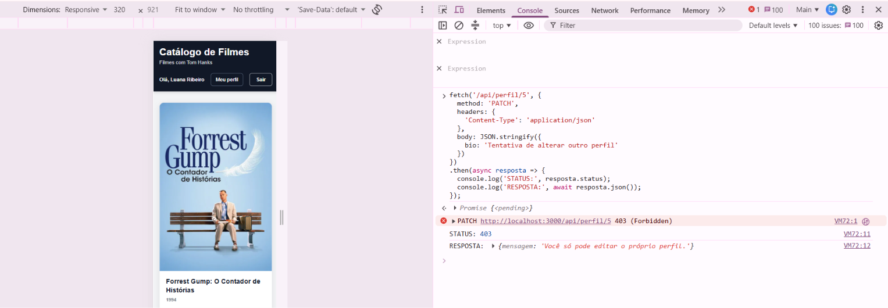

### Evidências anteriores — autenticação e recuperação de senha

<details>
<summary>Ver evidências preservadas das atividades anteriores</summary>

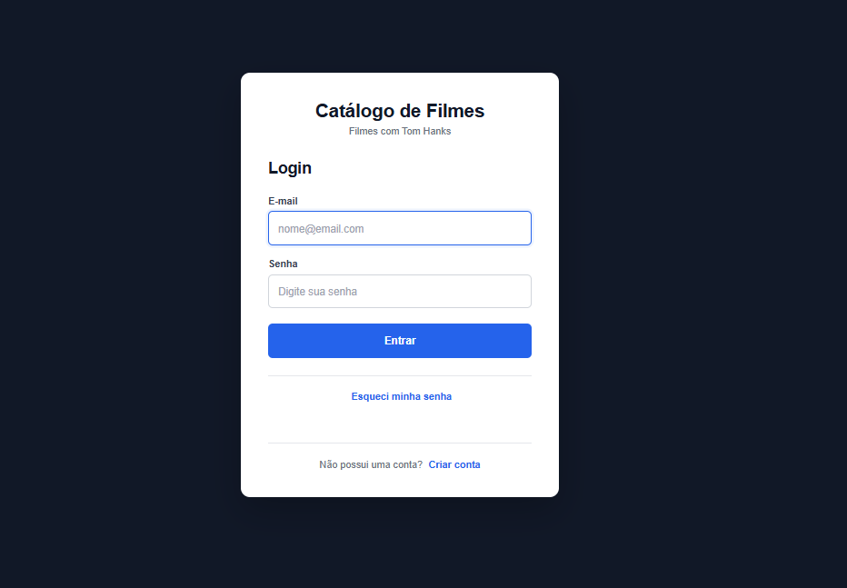
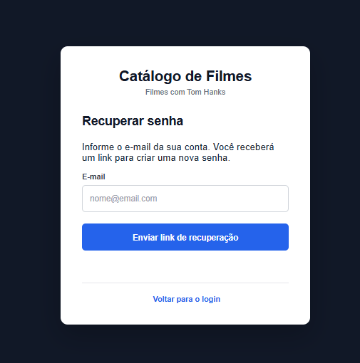

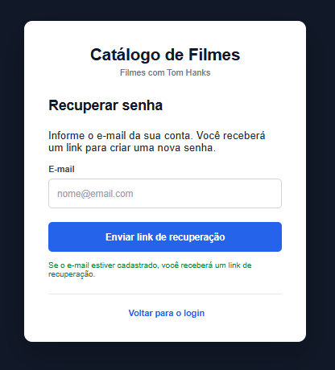
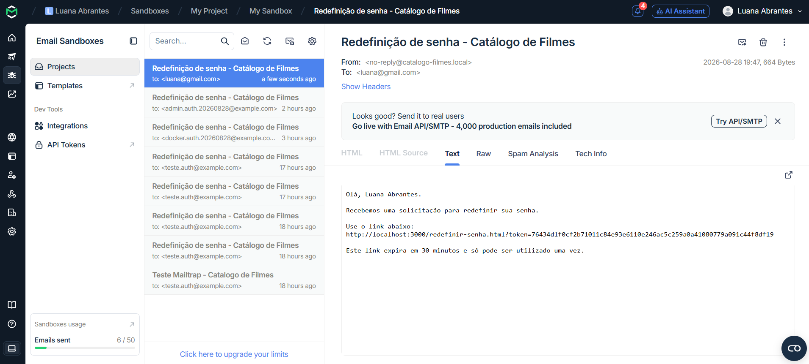
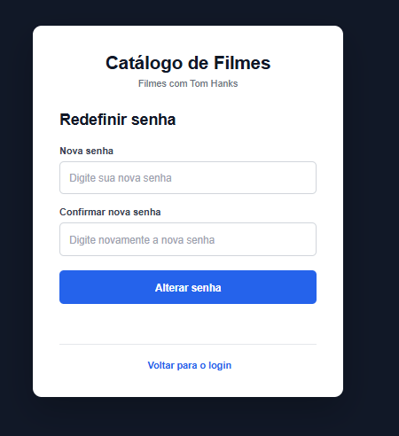
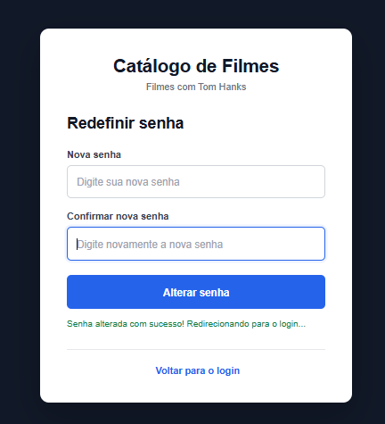
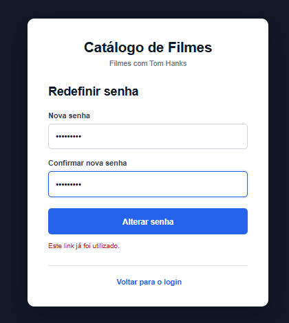

</details>

## Atividade extra — Swagger/OpenAPI

Atividade da disciplina **ISW055 — Introdução à Computação em Nuvem**, professor [@siriani](https://github.com/siriani). A documentação usa OpenAPI 3.0.3, `swagger-jsdoc` e `swagger-ui-express`, com anotações junto às rotas e schemas reutilizáveis.

### Serviços e contratos documentados

- **Catálogo (25 operações):** cadastro, login, sessão, logout, recuperação de senha, filmes TMDB, favoritos, comentários, auditoria, administração de usuários e perfil/upload de foto.
- **Auth-service (9 operações):** health, cadastro, login, validação da sessão, recuperação/redefinição de senha e administração de usuários. As rotas da especificação são as rotas internas reais.
- Especificações no repositório: [catálogo](docs/openapi/catalogo.json) e [auth-service](docs/openapi/auth.json). Schemas em [components.js](docs/openapi/components.js); contratos nos comentários `@openapi` dos arquivos de rotas.

### Executar e consultar localmente

```bash
npm ci
npm run docs:generate
npm run docs:validate
npm test
npm start
```

Configure as variáveis já utilizadas pelo projeto e mantenha o MariaDB e os serviços locais acessíveis ao catálogo. No Docker Compose, o catálogo usa `AUTH_SERVICE_URL=http://auth-service:3001` e `LOG_SERVICE_URL=http://log-service:3002`. Auth-service, log-service, Redis e MinIO continuam na rede interna, sem novas portas publicadas. Execute `docker compose up --build` quando o ambiente e as variáveis estiverem preparados. Não use serviços de produção para testar operações de escrita.

Com a porta padrão 3000:

- [Swagger do catálogo](http://localhost:3000/apidocs/).
- [Swagger do auth-service](http://localhost:3000/apidocs/auth/).
- Especificações servidas: [catálogo JSON](http://localhost:3000/openapi/catalogo.json) e [auth-service JSON](http://localhost:3000/openapi/auth.json).

É possível escolher outra porta com `PORT`. Na validação desta atividade foi usado `PORT=3010`, com o catálogo em `http://localhost:3010/apidocs/` e o auth-service documentado em `http://localhost:3010/apidocs/auth/`. A especificação pública usa a mesma origem (`servers: /`), sem fixar localhost para produção. A implementação está disponível no ambiente publicado:

- [Swagger do catálogo](https://luana-abrantes-isw055.lapps.studio/apidocs/).
- [Swagger do auth-service](https://luana-abrantes-isw055.lapps.studio/apidocs/auth/).

O `.dockerignore` permite copiar somente os arquivos JavaScript de `auth-service/src` para a imagem do catálogo, para leitura das anotações durante a geração da documentação. Não copia o `.env`, as dependências ou outros arquivos do auth-service e não executa esse serviço dentro do catálogo.

### Sessão e Try it out

O catálogo usa o cookie **`token`**, HttpOnly, SameSite=Lax, com duração de oito horas e Secure em produção. Entre com uma conta local em `/login.html`, no mesmo navegador e origem do Swagger, ou execute `POST /api/auth/login` com essa conta no Swagger. O navegador recebe e envia o cookie automaticamente. Não leia o cookie com JavaScript, não o cole em **Authorize** e não informe Bearer nas rotas públicas.

Para uma demonstração sem dados sensíveis e sem alterar registros:

1. Abra o Swagger local sem sessão autenticada.
2. Expanda **Autenticação → GET /api/auth/me**.
3. Clique em **Try it out → Execute**.
4. Confira em **Server response** o HTTP **401** e o corpo `{"mensagem":"Usuário não autenticado."}`. Esse é um retorno real esperado para sessão ausente; não representa um login bem-sucedido.
5. Com uma sessão local válida, a mesma consulta retorna **200** com `usuario` (`id`, `nome`, `email`, `role`). Esse cenário requer auth-service e banco local disponíveis.

O upload é `POST /api/perfil/{id}/foto`, `multipart/form-data`, campo único **`foto`**, JPEG/PNG/WebP estático de até **5 MiB** e **25 megapixels**. A bio aceita até 300 pontos de código Unicode após trim. A leitura de outro perfil é permitida a usuários autenticados; edição e upload exigem o proprietário, inclusive para administradores. O papel comum real é `usuario`; as operações administrativas exigem `admin`. Falta de autenticação é **401**; falta de permissão é **403**.

### Rotas internas e proxies existentes

O Swagger em `/apidocs/auth/` apresenta os contratos internos, mas o **Try it out é desabilitado nessa página**: o navegador não consegue acessar o endereço Docker `auth-service:3001`. Nenhuma operação interna foi exposta apenas para habilitar a documentação.

| Rota interna | Proxy existente no catálogo |
| --- | --- |
| `POST /auth/cadastro` | `POST /api/auth/cadastro` |
| `POST /auth/login` | `POST /api/auth/login` (transforma JWT em cookie; não retorna o token no corpo) |
| `GET /auth/validar` | `GET /api/auth/me` |
| `POST /auth/esqueci-senha` | `POST /api/auth/esqueci-senha` |
| `POST /auth/redefinir-senha` | `POST /api/auth/redefinir-senha` |
| `GET /auth/admin/usuarios` | `GET /api/admin/usuarios` |
| `PATCH /auth/admin/usuarios/{id}/role` | `PATCH /api/admin/usuarios/{id}/role` |
| `GET /health` | Sem proxy público |

Teste os proxies no Swagger do catálogo com cookie. Para uma chamada interna sem credenciais, dentro da rede Docker:

```bash
docker compose exec catalogo node -e "fetch('http://auth-service:3001/health').then(async r => console.log(r.status, await r.json()))"
```

`GET /auth/validar` e `/auth/admin/*` exigem `Authorization: Bearer` com um JWT de teste obtido pelo login interno; as demais rotas internas não usam Bearer. Para testá-las diretamente, execute um cliente dentro da rede Docker, mantenha os tokens apenas na memória e não os inclua em prints, comandos versionados ou exemplos. Em `/live`, sucesso significa somente processo ativo. `/health` verifica readiness, incluindo MariaDB e SMTP no auth-service, retornando 503 quando uma dependência falha.

### Evidência e validação

Foram executados os testes existentes, a validação OpenAPI e a comparação exata das especificações com as rotas reais dos dois serviços. No ambiente publicado, foi realizada a chamada **GET `/api/filmes`** pelo **Try it out → Execute** do Swagger do catálogo, com resposta **HTTP 200** e os dados dos filmes. O teste pelo navegador foi demonstrado na API pública do catálogo. O auth-service permanece na rede interna Docker, com Try it out desativado na página de suas rotas internas.

A execução final de `npm test` aprovou **52 testes** (49 existentes e 3 de documentação). As duas especificações passaram no validador OpenAPI. A imagem Docker local também foi testada em um contêiner temporário sem rede externa nem portas publicadas: os dois Swaggers e os dois JSONs retornaram 200, e a consulta de sessão sem cookie retornou 401. Nenhum `.env` foi copiado para a imagem. O teste de sessão autenticada com todos os serviços e banco local permanece para conferência em um ambiente completo. O `npm audit` reportou sete avisos em dependências já presentes no lockfile anterior (cinco moderados, um alto e um crítico), sem atualização dessas dependências nesta atividade.

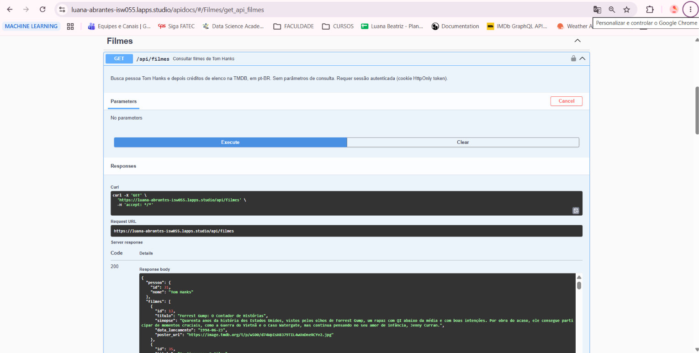

Execução real do GET `/api/filmes` pelo Swagger do catálogo no ambiente publicado, com HTTP 200 e dados dos filmes.

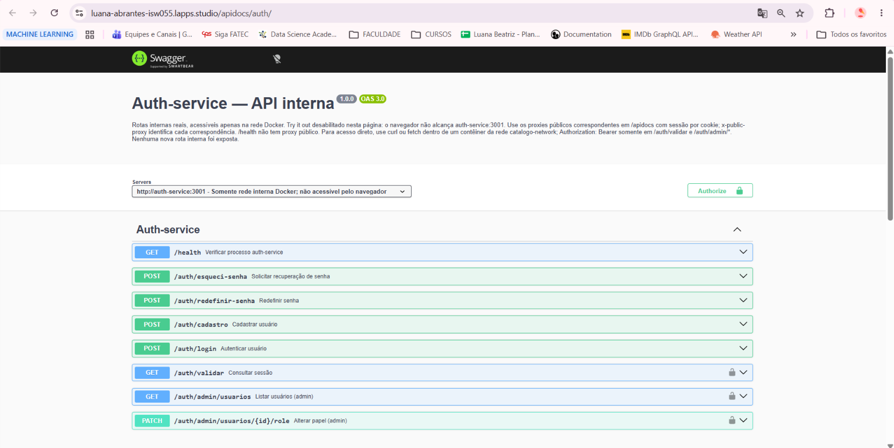

Documentação dos endpoints do auth-service, com Try it out desativado.

Implementação registrada no [commit 780dd4f](https://github.com/Luanaabrantes/catalogo-filmes/commit/780dd4f37f3c13471a8e285176372c805753b593), em 07/10/2026 às 21:15:01 (UTC−03:00).

Após mudar contratos ou schemas, execute novamente `npm run docs:generate`, `npm run docs:validate` e `npm test`. As verificações de documentação também detectam exportações desatualizadas e diferenças entre rotas documentadas e implementadas.

## Atividade extra — CI/CD

Atividade da disciplina ISW055, professor [@siriani](https://github.com/siriani). Modalidade inicial **quase automático**: testes, builds e publicação automáticos; atualização manual da stack no Portainer. A automação completa do deploy permanece pendente.

O workflow [cicd.yml](.github/workflows/cicd.yml) executa em push e pull request. Instala as dependências com `npm ci` na raiz, no auth-service e no log-service, executa `npm test` e `npm run docs:validate`, constrói e verifica as quatro imagens. Uma falha impede o job de publicação. Somente push para `atividade-extra-cicd` publica no GHCR as mesmas imagens verificadas, sem reconstrução.

Imagens publicadas pelo pipeline:

- `ghcr.io/luanaabrantes/catalogo-filmes-catalogo`
- `ghcr.io/luanaabrantes/catalogo-filmes-auth-service`
- `ghcr.io/luanaabrantes/catalogo-filmes-log-service`
- `ghcr.io/luanaabrantes/catalogo-filmes-minio`

Cada imagem recebe `latest`, `sha-<hash completo do commit>` e o label `org.opencontainers.image.revision`. Para implantação e rollback, use a tag SHA correspondente à execução aprovada, evitando `latest`.

### Portainer e acesso ao GHCR

O pipeline autentica com `secrets.GITHUB_TOKEN`, fornecido automaticamente pelo GitHub Actions, e usa `packages: write` somente no job de publicação. Esse token não é uma variável da aplicação nem deve ser copiado para o Portainer. Nenhuma credencial da aplicação é fornecida durante o build.

Confira a visibilidade dos quatro pacotes em GitHub → Packages. Para pull sem autenticação, torne-os públicos nas configurações dos pacotes, se desejado. Se permanecerem privados, configure o registro `ghcr.io` no Portainer com uma credencial de leitura autorizada (`read:packages`), sem inseri-la no Compose ou no repositório.

Use [docker-compose.portainer.yml](docker-compose.portainer.yml) na **mesma stack existente**, mantendo o caminho já configurado no Portainer, o nome da stack e seus volumes. Esse arquivo utiliza as imagens GHCR, sem build local; `docker-compose.cicd.yml` mantém a mesma configuração como referência e não precisa substituir o caminho da stack. Defina `IMAGE_TAG=sha-<hash completo do commit aprovado>` nas variáveis do Portainer. O Compose exige essa variável; confira que o valor começa com `sha-` e contém os 40 caracteres do hash. Preserve os valores existentes de banco, TMDB, JWT, SMTP e MinIO, fornecidos somente pelo Portainer. Não remova a stack ou os volumes `minio-data` e `audit-redis-data`: eles preservam as fotos e os eventos. A porta pública permanece `8216:3000`; serviços internos, rede, healthchecks e Redis com AOF permanecem iguais ao Compose do Portainer.

Após conferir a execução verde e o acesso às quatro imagens, atualize manualmente a stack solicitando o pull das imagens com a tag SHA. Verifique os serviços e o funcionamento da aplicação. Para rollback, restaure `IMAGE_TAG` para uma tag SHA anterior aprovada e atualize a mesma stack, preservando os volumes e as variáveis. Rollback de imagem não desfaz alterações nos dados.

### Validação e evidências

A [execução 37709376462 do GitHub Actions](https://github.com/Luanaabrantes/catalogo-filmes/actions/runs/37709376462) concluiu os jobs de verificação e publicação com sucesso. Os 52 testes e a validação das duas especificações OpenAPI passaram; as quatro imagens foram construídas, verificadas e publicadas com `latest` e `sha-24abe30d9245ec177ea96343e5d6ee5eb4cf2bcb`. Essa tag identifica o commit validado nesta execução e pode ser usada no Portainer. Nenhuma atualização do ambiente de produção foi realizada nesta etapa.

Print do container no Portainer: **pendente**, arquivo previsto `docs/evidencias/atividade-extra-cicd-container.png`. A imagem será incluída somente após a atualização manual e sua captura. Deploy completamente automático: **pendente**.

## Atividade extra — Observabilidade: health checks e métricas

Atividade ISW055, professor [@siriani](https://github.com/siriani). Implementada a partir de `atividade-extra-cicd`, preservando perfil/upload, Swagger e o fluxo de publicação GHCR e atualização manual no Portainer.

### Liveness e readiness

Os três serviços Node.js expõem `GET /live` (HTTP 200 quando o processo responde, sem consultar dependências) e `GET /health` (HTTP 200 pronto, HTTP 503 se uma dependência falhar). Os probes executam em paralelo com prazo de dois segundos; conexões SQL são descartáveis, têm timeouts de conexão/consulta e são encerradas. HTTP usa timeout de 1,8 segundo, SMTP usa timeouts de 700 ms e Redis usa PING com prazo de 1,5 segundo. As respostas mostram somente nomes de dependências e `ok`/`indisponivel`, sem hosts, credenciais ou mensagens internas.

| Serviço | Dependências verificadas por `/health` |
|---|---|
| Catálogo | MariaDB (`SELECT 1`), `/health` do auth-service, readiness do MinIO e consulta GET autenticada da configuração TMDB |
| Auth-service | MariaDB (`SELECT 1`) e conexão/autenticação SMTP (`verify`, sem enviar e-mail) |
| Log-service | Redis conectado com `PING`/`PONG` e readiness do auth-service, necessário à consulta protegida dos eventos |

A gravação da auditoria continua de melhor esforço: catálogo e auth-service não dependem de `/health` do log-service, evitando um ciclo e preservando login, favoritos e comentários quando a auditoria falha. Não há escrita de dados ou envio de e-mail pelos probes. Readiness detecta disponibilidade das dependências; não substitui testes de migrações ou de todas as funcionalidades.

Os Dockerfiles e os três Compose existentes usam `/health`, com intervalo de cinco segundos, três falhas consecutivas e período inicial de 20 segundos. A falha altera o estado para `unhealthy`; o healthcheck não reinicia automaticamente o processo. O cliente Redis existente reconecta, permitindo recuperar `healthy` após a volta do Redis. Portas, redes, volumes, variáveis e seleção das imagens por `IMAGE_TAG` foram preservados. O workflow mantém publicação exclusivamente em push para `atividade-extra-cicd`; a branch de observabilidade executa verificações, sem publicar ou atualizar a produção.

### Métricas do catálogo

`GET /metrics` expõe o formato Prometheus usando `prom-client` 15. `http_requisicoes_total` conta requisições e `http_requisicao_duracao_segundos` registra latência em histograma, ambos por `metodo`, `rota` e `status`. Rotas usam templates, por exemplo `/api/perfil/:id`, sem IDs ou query strings. Rotas não mapeadas usam `/nao-mapeada`; erros de parsing e respostas 4xx/5xx também são contados. Conexões interrompidas usam 499. A própria consulta `/metrics` aparece na coleta seguinte. Não são registrados usuário, IP, cookie, token ou corpo. A biblioteca solicitada foi mantida na versão 15; o npm informa que versões futuras usam o nome `@prometheus-io/client`.

Swagger e exportações JSON incluem `/health`, `/live` e `/metrics` do catálogo e `/health` e `/live` internos do auth-service. Não foram publicados proxies novos para os serviços internos.

### Executar e validar sem tocar na produção

Na raiz, execute `npm ci`, `npm ci --prefix auth-service`, `npm ci --prefix log-service`, `npm test` e `npm run docs:validate`. O laboratório usa uma stack separada, sem portas públicas, com MariaDB, SMTP de teste, Redis e MinIO próprios. O preparador gera credenciais descartáveis em `tmp/observabilidade/.env` e utiliza somente o token TMDB já configurado em `.env` para uma consulta GET de leitura. Esse arquivo é excluído do build e deve permanecer fora do Git. Não imprima seu conteúdo.

```powershell
node scripts/preparar-observabilidade-test.js
docker compose --env-file tmp/observabilidade/.env -p observabilidade-qa -f docker-compose.observabilidade-test.yml up -d --build
node scripts/validar-observabilidade-docker.js
```

Não execute novamente o preparador com os volumes do laboratório já inicializados: ele gera outra senha. Para reutilizar a stack, mantenha o arquivo de ambiente original. O script aguarda todos os estados healthy, consulta `/health` e `/live`, para **somente o Redis do laboratório**, confirma `unhealthy` e HTTP 503, restaura o Redis e confirma recuperação sem reiniciar o log-service. Também consulta erros reais e verifica as métricas por template. O SMTP é real no laboratório, mas é Mailpit; não é uma validação do Mailtrap de produção.

### Evidências e reprodução da validação

Use somente o projeto `observabilidade-qa`. Em PowerShell, defina:

```powershell
$qaCompose = @('--env-file', 'tmp/observabilidade/.env', '-p', 'observabilidade-qa', '-f', 'docker-compose.observabilidade-test.yml')
docker compose @qaCompose ps
```

1. Aguarde os serviços da aplicação, Redis, MinIO e MariaDB `healthy`. Capture a listagem sem abrir variáveis de ambiente: `docs/prints/observabilidade-healthy.png`.
2. Execute os comandos abaixo, aguarde aproximadamente 20 segundos e confirme `unhealthy` no log-service. Capture a listagem e HTTP 503 como `docs/prints/observabilidade-redis-unhealthy.png`:

```powershell
docker compose @qaCompose stop -t 3 redis
docker compose @qaCompose ps
docker compose @qaCompose exec -T log-service node -e "fetch('http://127.0.0.1:3002/health').then(async r => console.log(r.status, await r.json()))"
docker compose @qaCompose exec -T log-service node -e "fetch('http://127.0.0.1:3002/live').then(async r => console.log(r.status, await r.json()))"
docker compose @qaCompose start redis
```

3. Aguarde a recuperação automática para `healthy` e execute os comandos abaixo. Capture contador e histograma como `docs/prints/observabilidade-metrics.png`:

```powershell
docker compose @qaCompose exec -T catalogo node -e "Promise.all(['/api/perfil/123','/api/perfil/456','/rota-inexistente'].map(p => fetch('http://127.0.0.1:3000'+p))).then(() => console.log('Requisições de teste concluídas'))"
docker compose @qaCompose exec -T catalogo node -e "fetch('http://127.0.0.1:3000/metrics').then(async r => console.log(r.status, await r.text()))"
```

Para encerrar somente o laboratório, execute `docker compose @qaCompose down` (sem `-v`, preservando seus dados). As quatro capturas da validação estão apresentadas abaixo. Prometheus/Grafana e implantação em produção não foram realizados.

Validação concluída no laboratório: **56 testes automatizados aprovados, zero falhas**, duas especificações OpenAPI válidas e quatro imagens construídas. Catálogo, auth-service, log-service, MariaDB, Redis e MinIO ficaram healthy. Ao parar somente o Redis, o log-service passou a unhealthy, `/health` retornou 503 e `/live` retornou 200; o catálogo continuou pronto. Após restaurar o Redis, o log-service voltou a healthy sem reinício, confirmado pela data de início do mesmo container. As métricas reais registraram contador, histograma, respostas 401/404 e o template `/api/perfil/:id`, sem IDs nos labels. Os quatro testes novos também verificam 403, 500, JSON inválido, timeout e ausência de detalhes sensíveis. As capturas documentam os estados de saúde e as métricas do laboratório isolado.

Implementação: [commit d672301](https://github.com/Luanaabrantes/catalogo-filmes/commit/d672301f5defa185e96ba3118f2605ca12057cd2), em 07/10/2026 às 23:15:00 (UTC−03:00). [Execução aprovada no GitHub Actions](https://github.com/Luanaabrantes/catalogo-filmes/actions/runs/37716954218).

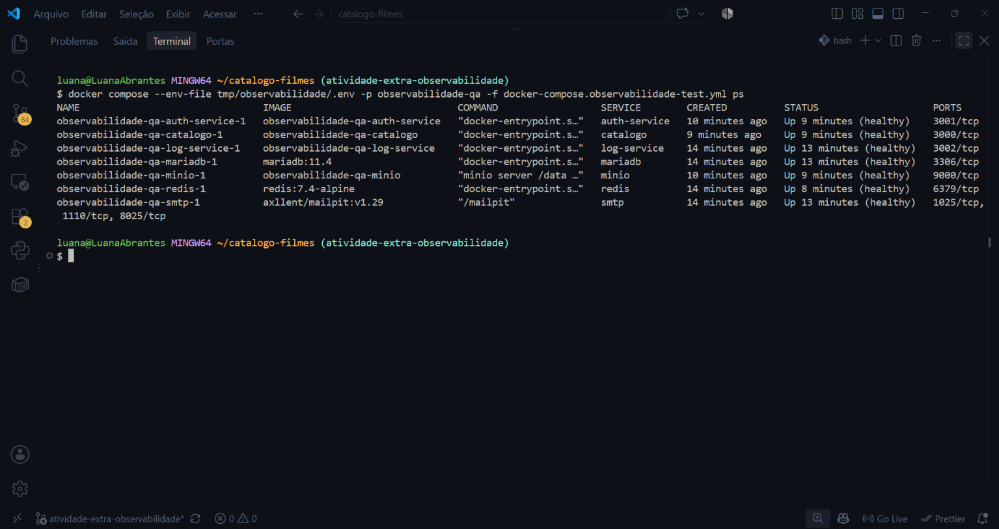

Serviços do laboratório com health checks em estado healthy.

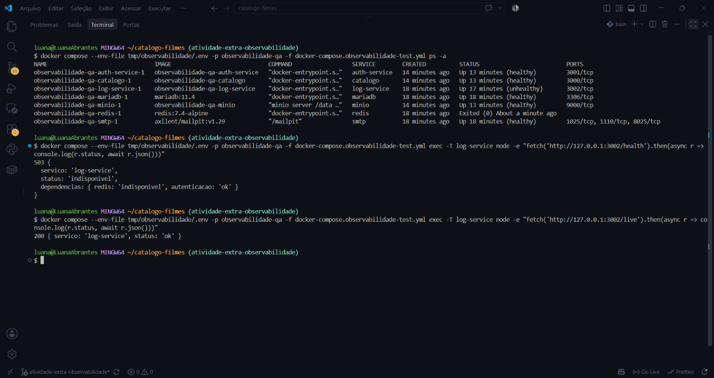

Redis interrompido: log-service unhealthy, /health com HTTP 503 e /live com HTTP 200.

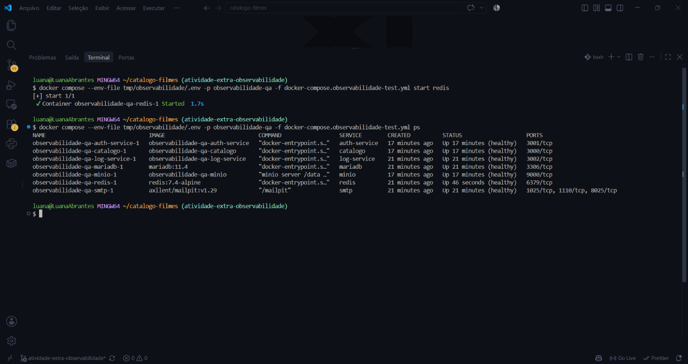

Recuperação do log-service para healthy após restaurar o Redis, sem reiniciar o serviço de logs.

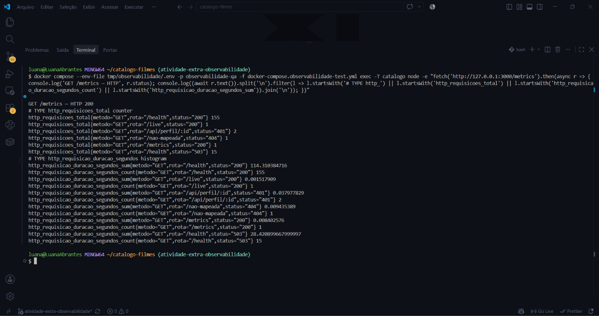

Endpoint /metrics com HTTP 200, contador de requisições e histograma de latência por método, rota e status.

## Atividade 7 — Plano Premium: cobrança com Stripe

Atividade ISW055, professor [@siriani](https://github.com/siriani). A comparação dos planos e a sequência de evidências usam como referência [o projeto do Leonardo](https://github.com/leonardoricci-tsi/api_filme_), adaptadas a este catálogo: **Gratuito** mantém catálogo, favoritos, comentários, foto e bio; **Premium**, por **R$ 9,90/mês**, acrescenta o selo no perfil durante o período efetivamente pago. Premium continua separado dos papéis usuario/admin.

### Informação do assinante e validação de acesso

O perfil mostra plano, valor, situação e, quando disponível, **Próxima renovação: DD/MM/AAAA** ou **Seu acesso Premium termina em DD/MM/AAAA**. Datas reais são formatadas em America/Sao_Paulo. Pagamento pendente mostra regularização. Se não houver data, a linha é omitida. IDs técnicos não aparecem na interface.

O SDK oficial Stripe 23 usa explicitamente a API **2026-09-30.endive**. Consulte [linha da fatura](https://docs.stripe.com/api/invoice-line-item/object), [item da assinatura](https://docs.stripe.com/api/subscription_items/object) e [assinatura](https://docs.stripe.com/api/subscriptions/object). Os campos também foram conferidos nos tipos do SDK. O período pago vem de invoice.lines.data[].period.start/end de uma linha do preço correto, não proporcional, ligada ao item e à assinatura. A próxima renovação vem de subscription.items.data[].current_period_end. Cancelamento usa cancel_at_period_end/cancel_at; canceled_at não é usado como término, pois pode representar o momento do pedido. Fatura paga usa status=paid, não o antigo booleano paid.

GET /api/premium/status calcula acesso pelo usuário da sessão, vínculos, preço, período e situação persistidos, sem chamar Stripe por requisição. Ignora IDs enviados pelo navegador e não expõe cliente, assinatura ou fatura. O campo persistido premium é apenas uma projeção: sozinho não autoriza acesso após o período passar. O middleware exigirPremium, exportado por criarPremium, usa a mesma regra para benefícios futuros, depois do middleware de sessão. Favoritos e comentários permanecem gratuitos.

POST /api/premium/checkout continua autenticado e define usuário, cliente, preço e URLs no backend. Reutiliza checkout aberto e impede assinatura duplicada. Preço deve ser de teste, ativo, BRL e 990 centavos/mês. O redirecionamento de sucesso não concede Premium.

POST /api/stripe/webhook continua antes do parser JSON, com bytes brutos e assinatura validada pelo SDK. invoice.paid consulta a fatura atual e confere pagamento, moeda/valor, usuário/cliente/assinatura/item/preço e período. Assinatura ativa sozinha não comprova pagamento. Situação vem de uma consulta atual ao Stripe sob lock, sem confiar no snapshot antigo. state_event_created protege a situação mais recente; períodos pagos só avançam, nunca são encurtados por eventos antigos. Períodos pagos consecutivos são unidos, preservando acesso quando uma renovação é paga antecipadamente.

Eventos têm ID único em stripe_eventos e atualização transacional. Duplicatas não reaplicam alterações; falhas fazem rollback e retornam 503 para reenvio. Não são armazenados payloads, cartão, CVV, validade ou mensagens internas Stripe.

Cancelamento programado mantém acesso até o menor limite entre fim pago e data de cancelamento. Ao expirar sem renovação paga, o backend nega Premium mesmo sem novo webhook. Falha de pagamento mostra regularização e preserva somente o período já pago ainda válido. Cancelamento imediato ou estado não permitido retira acesso.

### Variáveis exclusivamente de teste

Use somente o .env local ignorado pelo Git ou as variáveis privadas da stack. Produto de teste existente: prod_VPF449RTyeo8rr.

| Variável | Configuração |
|---|---|
| STRIPE_SECRET_KEY | Chave de teste iniciada por sk_test_; nunca live |
| STRIPE_PRICE_ID | price_1UOQaV6maMe1gZ6DZBOAsuwh |
| STRIPE_WEBHOOK_SECRET | Segredo do endpoint Dashboard publicado ou listener CLI local, conforme ambiente |
| APP_BASE_URL | Publicado: https://luana-abrantes-isw055.lapps.studio; local: http://localhost:3000 |

Compose passa essas variáveis somente ao catálogo. Chaves de produção e objetos/eventos livemode=true são rejeitados. NODE_ENV=production não autoriza Stripe live. Sem Stripe configurado, as funções anteriores continuam disponíveis e assinar retorna erro claro.

### Migração complementar segura

A migração original database/migracao-atividade7.sql já criou as duas tabelas no banco publicado confirmado IAC_2026_02_luana_abrantes. O novo complemento **database/migracao-atividade7-periodo.sql** adiciona apenas oito campos: preço, início/fim pago, cancelamento programado/data, renovação, pagamento pendente e marca temporal de evento. Não inventa datas para assinaturas existentes.

Faça **novo backup atualizado**, incluindo a assinatura já paga e as tabelas Premium, e valide a restauração. O backup anterior à criação dessas tabelas não substitui esse novo backup. Confira o destino diretamente no Console do catálogo publicado:

~~~sh
node -e "console.log(JSON.stringify({host:process.env.DB_HOST,porta:process.env.DB_PORT,banco:process.env.DB_NAME}))"
~~~

Aplique o complemento com sua ferramenta SQL autorizada **antes de atualizar a aplicação**. ADD COLUMN IF NOT EXISTS é reexecutável, mas DDL do MariaDB faz commit implícito: confira estrutura em falha parcial. Não remova tabelas ou volumes. Para uma instalação nova, node scripts/migrar-premium.js --aplicar executa original e complemento; no host, o .env deve apontar ao destino confirmado.

### Sincronizar a assinatura já paga da Luana

Depois da migração e da atualização autorizada, no Console do catálogo em /app, execute os comandos abaixo, substituindo ID_DA_LUANA pelo ID numérico real obtido na sua ferramenta SQL privada:

~~~sh
node scripts/sincronizar-premium.js --usuario-id ID_DA_LUANA
node scripts/sincronizar-premium.js --usuario-id ID_DA_LUANA --aplicar
~~~

O primeiro comando é **prévia**, sem UPDATE no banco. A sincronização consulta a assinatura existente e pagina suas faturas pagas, valida vínculos/preço e usa o período real da fatura paga com término mais recente. Somente --aplicar grava transacionalmente. Não cria cliente, checkout, assinatura, fatura ou pagamento. A saída contém apenas situação pública, sem IDs Stripe ou dados de cartão. Não há endpoint HTTP de sincronização ou alteração que aceite usuário de terceiros.

Se faltar cliente vinculado ou houver ambiguidade/divergência de metadata/cliente, o comando falha fechado. Confira os vínculos do Checkout original; não ative Premium manualmente. Não exige novo pagamento nem segredo no chat.

### Atualização do Portainer

Esta melhoria não faz merge nem deploy. O workflow publica quatro imagens GHCR após verificações em push da branch atividade-7-stripe-premium, por tag sha-HASH_COMPLETO, sem alterar latest. A tag sha-1c2912ad6f6e0aebd2ba031e3746020ec6b04c8e contém a versão anterior. Use o novo commit somente após o job publicar aprovado.

1. Confira o banco real e faça o novo backup; aplique **migracao-atividade7-periodo.sql** e verifique os oito campos, preservando registros.
2. Use a **mesma stack**. Se usa Git: repositório https://github.com/Luanaabrantes/catalogo-filmes, referência refs/heads/atividade-7-stripe-premium, arquivo docker-compose.portainer.yml. Se usa Web editor, mantenha essa modalidade e o conteúdo desse arquivo.
3. Defina IMAGE_TAG=sha-HASH_COMPLETO_DO_NOVO_COMMIT. Preserve todas as variáveis existentes, a porta 8216:3000, rede catalogo-network/subnet 10.88.0.0/24 e volumes minio-data e audit-redis-data. Não recrie a stack ou exclua volumes.
4. Atualize pedindo pull das imagens; aguarde saúde dos serviços. Confira /live, /health, login, foto, bio, favoritos e comentários.
5. Execute a prévia e a sincronização acima. Recarregue o perfil da Luana e confira situação/data, sem repetir o checkout.
6. No Dashboard de **testes**, mantenha endpoint snapshot/API 2026-09-30.endive em **https://luana-abrantes-isw055.lapps.studio/api/stripe/webhook**. Eventos: invoice.paid, invoice.payment_failed, customer.subscription.created, customer.subscription.updated, customer.subscription.deleted. O segredo desse endpoint vai diretamente no STRIPE_WEBHOOK_SECRET privado do catálogo, não no Git/chat nem substituído pelo segredo CLI.

Verificação administrativa do período, substituindo o ID:

~~~sql
SELECT usuario_id, status, premium,
       FROM_UNIXTIME(paid_period_start) AS inicio_pago,
       FROM_UNIXTIME(paid_period_end) AS fim_pago,
       cancel_at_period_end, payment_problem,
       (stripe_customer_id IS NOT NULL AND stripe_subscription_id IS NOT NULL
        AND stripe_paid_invoice_id IS NOT NULL
        AND stripe_price_id = 'price_1UOQaV6maMe1gZ6DZBOAsuwh'
        AND paid_period_start <= UNIX_TIMESTAMP()
        AND paid_period_end > UNIX_TIMESTAMP()
        AND (cancel_at IS NULL OR cancel_at > UNIX_TIMESTAMP())
        AND status IN ('active','past_due','unpaid')) AS premium_efetivo
FROM premium_assinaturas WHERE usuario_id = ID_DA_LUANA;
~~~

### Execução local e verificações

Após conferir e fazer backup do destino local escolhido:

~~~powershell
docker compose build
docker compose run --rm --no-deps catalogo node scripts/migrar-premium.js --aplicar
docker compose up -d
docker compose ps
npm test
npm run docs:generate
npm run docs:validate
node scripts/validar-premium-mariadb.js
~~~

CLI oficial no Windows: npm install -g @stripe/cli, depois stripe login e:

~~~powershell
stripe listen --events invoice.paid,invoice.payment_failed,customer.subscription.created,customer.subscription.updated,customer.subscription.deleted --forward-to http://localhost:3000/api/stripe/webhook
~~~

Copie o segredo do listener diretamente ao .env local e recrie somente catálogo com docker compose up -d --no-deps --force-recreate catalogo. Não imprima o arquivo.

Foram executados **84 testes, zero falhas**, OpenAPI válido para catálogo/auth e laboratório MariaDB 11.4 validando complemento reexecutável e preservação dos registros. Stripe é simulado nos testes, com assinatura criptográfica real do SDK. Casos incluem período vencido, renovação paga, falha, cancelamento programado, duplicatas, eventos fora de ordem, guarda Premium, isolamento da identidade e datas pt-BR/omissão.

O banco remoto 35.226.64.52:3306/IAC_2026_02_luana_abrantes foi confirmado por conexão direta. Um backup atualizado das sete tabelas, incluindo premium_assinaturas e stripe_eventos, foi restaurado em MariaDB isolado e comparado registro a registro. O complemento foi aplicado, com oito colunas conferidas e preservação dos dados anteriores: 30 usuários, 31 favoritos, 3 perfis, 19 comentários, 30 tokens de redefinição, 1 assinatura e 2 eventos. Backup e manifestos permanecem privados e ignorados pelo Git.

Uma consulta somente de leitura ao Stripe de teste confirmou que a assinatura persistida, o cliente, a metadata usuario_id e a fatura paga pertencem ao usuário **39**. A identidade não foi escolhida pelo nome. Após atualizar a imagem no Portainer, execute a prévia **node scripts/sincronizar-premium.js --usuario-id 39** e, se os dados estiverem corretos, **node scripts/sincronizar-premium.js --usuario-id 39 --aplicar** no Console do catálogo em /app. **A sincronização aplicada e a nova interface publicada ainda não foram verificadas.** Não foi feito novo pagamento ou deploy.

### Evidências organizadas, sem prints inventados

Siga [o roteiro da atividade 7](docs/evidencias/atividade-7-roteiro.md): gratuito → checkout de teste concluído → pagamento confirmado → banco após webhook → perfil Premium com selo e data. As novas capturas estão pendentes. Não reutilize imagens do Leonardo como evidência deste catálogo, nem revele segredos, hashes de senha ou dados do cartão.

## Tecnologias

Node.js, Express, JavaScript, HTML, CSS, MariaDB, MySQL2, `bcryptjs`, `jsonwebtoken`, Nodemailer, API TMDB, Redis, Redis Streams, MinIO, Multer, Sharp, Docker e Docker Compose.

## Links

- **Relatório P1:** [PDF final — Luana Abrantes](docs/P1_ISW055_Luana_Abrantes.pdf)

- **Aplicação:** [https://luana-abrantes-isw055.lapps.studio/](https://luana-abrantes-isw055.lapps.studio/)
- **Repositório:** [https://github.com/Luanaabrantes/catalogo-filmes](https://github.com/Luanaabrantes/catalogo-filmes)
- **Professor:** [@siriani](https://github.com/siriani)

Desenvolvido por **Luana Abrantes** para a disciplina **ISW055 — Introdução à Computação em Nuvem**.
